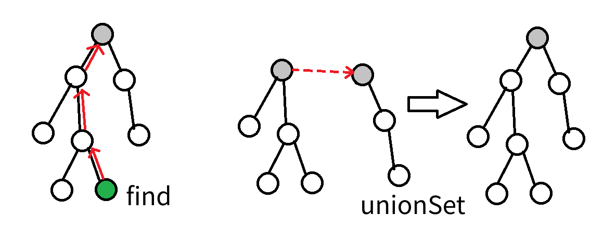

# Union-Find 算法总结

uf算法非常简洁，通常用于求解连通性问题。

提供两种操作：1. 查找（元素属于哪个集合） 2. 合并（合并两个集合）

```cpp
int find(int x) {
  if (x != fa[x])  // x不是自身的父亲，即x不是该集合的代表
    fa[x] = find(fa[x]);  // 查找x的祖先直到找到代表,于是顺手路径压缩
  return fa[x];
}
```



