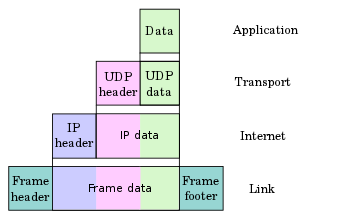

## 网络体系结构

网络体系结构通过分层来实现

数据格式(UDP)

为什么要使用分层架构？

1. 对于一个大型应用分层能够简化复杂度 本质上是分离关键点，而让问题简单化，模块化。当一个系统足够复杂时，通过聚合分为不同层次或不同模块， 每层或模块都是内聚的，对外屏蔽复杂性。 那么宏观上看去，管理和问题定位很容易到具体层次和模块。 然后层层递进，很容易定位问题。
2. 开发人员可以针对某一层的结构，每层都是独立的。
3. 容易使用新的实现替换某一层的内容
4. 降低系统的耦合程度，减少依赖
5. 逻辑复用
6. 标准化

## 应用层协议

[HTTP](https://zh.wikipedia.org/wiki/超文本传输协议)、[SMTP](https://zh.wikipedia.org/wiki/简单邮件传输协议)、[SNMP](https://zh.wikipedia.org/wiki/简单网络管理协议)、[FTP](https://zh.wikipedia.org/wiki/文件传输协议)、[Telnet](https://zh.wikipedia.org/wiki/Telnet)、[SIP](https://zh.wikipedia.org/wiki/会话发起协议)、[SSH](https://zh.wikipedia.org/wiki/Secure_Shell)、[NFS](https://zh.wikipedia.org/wiki/网络文件系统)、[RTSP](https://zh.wikipedia.org/wiki/RTSP)、[XMPP](https://zh.wikipedia.org/wiki/XMPP)、[Whois](https://zh.wikipedia.org/wiki/WHOIS)、[ENRP](https://zh.wikipedia.org/w/index.php?title=ENRP&action=edit&redlink=1)、[TLS](https://zh.wikipedia.org/wiki/傳輸層安全性協定)、DNS

运行在[TCP](https://zh.wikipedia.org/wiki/传输控制协议)协议上的协议：

- [HTTP](https://zh.wikipedia.org/wiki/超文本传输协议)（Hypertext Transfer Protocol，超文本传输协议），主要用于普通浏览。
- [HTTPS](https://zh.wikipedia.org/wiki/超文本传输安全协议)（Hypertext Transfer Protocol over Secure Socket Layer, or HTTP over SSL，安全超文本传输协议）,HTTP协议的安全版本。
- [FTP](https://zh.wikipedia.org/wiki/文件传输协议)（File Transfer Protocol，文件传输协议），由名知义，用于文件传输。
- [POP3](https://zh.wikipedia.org/wiki/郵局協定)（Post Office Protocol, version 3，邮局协议），收邮件用。
- [SMTP](https://zh.wikipedia.org/wiki/简单邮件传输协议)（Simple Mail Transfer Protocol，简单邮件传输协议），用来发送电子邮件。
- [TELNET](https://zh.wikipedia.org/wiki/Telnet)（Teletype over the Network，网络电传），通过一个终端（terminal）登陆到网络。
- [SSH](https://zh.wikipedia.org/wiki/Secure_Shell)（Secure Shell，用于替代安全性差的[TELNET](https://zh.wikipedia.org/wiki/TELNET)），用于加密安全登陆用。

运行在[UDP](https://zh.wikipedia.org/wiki/用户数据报协议)协议上的协议：

- [BOOTP](https://zh.wikipedia.org/wiki/BOOTP)（Boot Protocol，启动协议），应用于无盘设备。
- [NTP](https://zh.wikipedia.org/wiki/網路時間協定)（Network Time Protocol，网络时间协议），用于网络同步。
- [DHCP](https://zh.wikipedia.org/wiki/动态主机设置协议)（Dynamic Host Configuration Protocol，动态主机配置协议），动态配置IP地址。

其他：

- [DNS](https://zh.wikipedia.org/wiki/域名系统)（Domain Name Service，域名服务），用于完成地址查找，邮件转发等工作（运行在[TCP](https://zh.wikipedia.org/wiki/传输控制协议)和[UDP](https://zh.wikipedia.org/wiki/用户数据报协议)协议上）。
- [ECHO](https://zh.wikipedia.org/w/index.php?title=ECHO&action=edit&redlink=1)（Echo Protocol，回绕协议），用于查错及测量应答时间（运行在[TCP](https://zh.wikipedia.org/wiki/传输控制协议)和[UDP](https://zh.wikipedia.org/wiki/用户数据报协议)协议上）。
- [SNMP](https://zh.wikipedia.org/wiki/简单网络管理协议)（Simple Network Management Protocol，简单网络管理协议），用于网络信息的收集和网络管理。
- [ARP](https://zh.wikipedia.org/wiki/地址解析协议)（Address Resolution Protocol，地址解析协议），用于动态解析以太网硬件的地址。

## 传输层协议

[TCP](https://zh.wikipedia.org/wiki/传输控制协议)、[UDP](https://zh.wikipedia.org/wiki/用户数据报协议)、[RTP](https://zh.wikipedia.org/wiki/实时传输协议)、[SCTP](https://zh.wikipedia.org/wiki/流控制传输协议)

## 网络层协议

[IP](https://zh.wikipedia.org/wiki/网际协议)、[ICMP](https://zh.wikipedia.org/wiki/互联网控制消息协议)、[IPX](https://zh.wikipedia.org/wiki/互联网分组交换协议)、[BGP](https://zh.wikipedia.org/wiki/边界网关协议)、[OSPF](https://zh.wikipedia.org/wiki/OSPF)、[RIP](https://zh.wikipedia.org/wiki/路由信息协议)、[IGRP](https://zh.wikipedia.org/wiki/IGRP)、[EIGRP](https://zh.wikipedia.org/wiki/EIGRP)、[ARP](https://zh.wikipedia.org/wiki/地址解析协议)、[RARP](https://zh.wikipedia.org/wiki/RARP)

## 链路层协议

以太网、令牌环、IEEE 802.11

## 参考

[TCP/IP](https://zh.wikipedia.org/zh-cn/TCP/IP%E5%8D%8F%E8%AE%AE%E6%97%8F)

