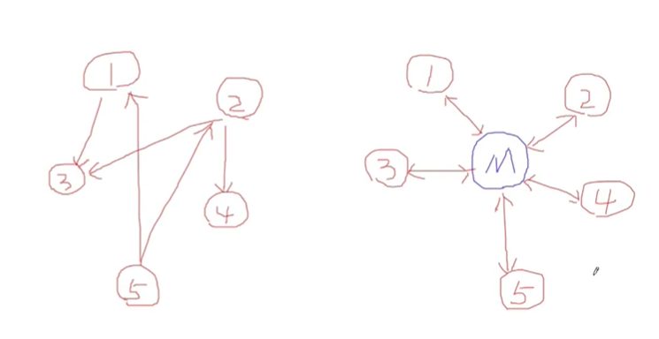

# 中介者模式

中介者解决的问题是，在多个类需要相互通信的情况下，减少相互依赖产生的耦合问题。

适用于：用一个中介对象，封装一些列对象（同事）的交换，中介者是各个对象不需要显示的相互作用，从而实现了耦合松散，而且可以独立的改变他们之间的交换。

优点：

- 1、将系统按功能分割成更小的对象，符合类的最小设计原则
- 2、对关联对象的集中控制
- 3、减小类的耦合程度，**明确类之间的相互关系**：当类之间的关系过于复杂时，其中任何一个类的修改都会影响到其他类，不符合类的设计的开闭原则 ，而Mediator模式将原来相互依存的多对多的类之间的关系简化为Mediator控制类与其他关联类的一对多的关系，当其中一个类修改时，可以对其他关联类不产生影响（即使有修改，也集中在Mediator控制类）。
- 4、有利于提高类的重用性

一个难点在于如何设计mediator的通信，以及多少规模的情况下使用mediator。

用户直接通信变成了用户通过中介来进行通信！

