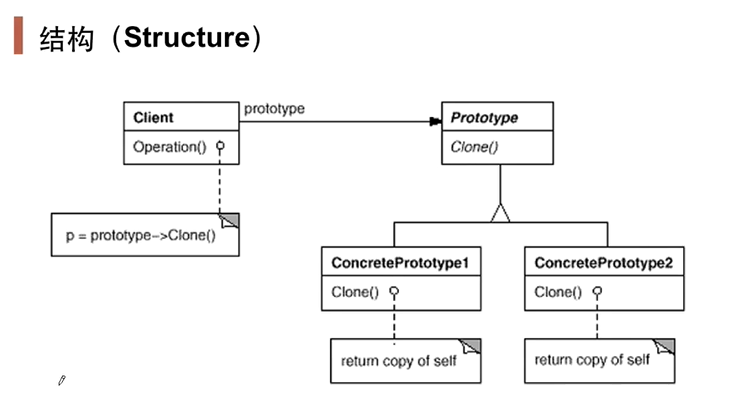
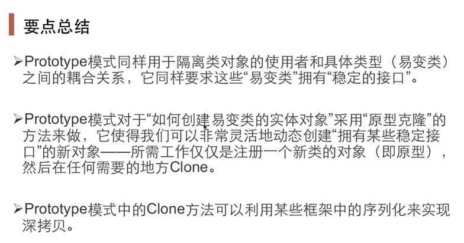

# 原型方法

使用工厂模式创建对象时可能会遇到一个问题，当类创建有很多参数（状态较多）时会变得比较复杂，原型用来解决创建时复杂度较高的问题，通过使用复制构造函数来解决这个问题！有一个很重要的前提接口要相对稳定！

使用Prototype模式创建的实例，具有与原型一样的状态。

- 1）由原型对象自身创建目标对象。也就是说，对象创建这一动作发自原型对象本身。
- 2）目标对象是原型对象的一个克隆。也就是说，通过Prototype模式创建的对象，不仅仅与原型对象具有相同的结构，还与原型对象具有相同的值。
- 3）根据对象克隆深度层次的不同，有浅度克隆与深度克隆。

