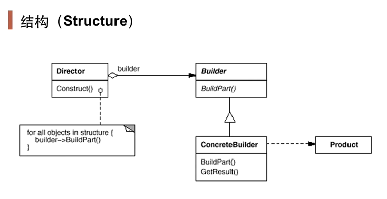
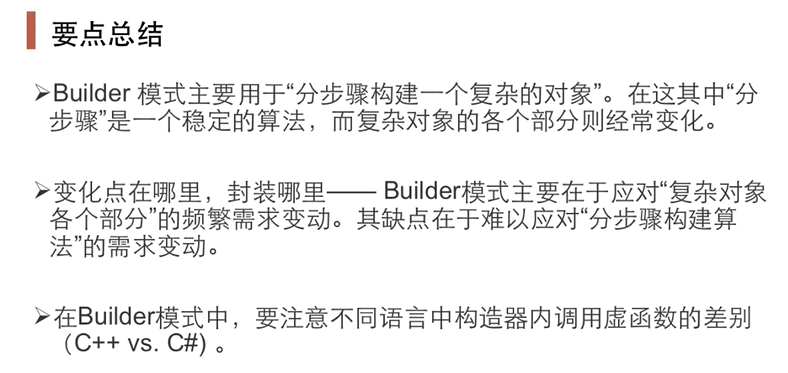

# 构造器模式

构造器用来隐藏复合对象的创建过程，它把复合对象的创建过程加以抽象，通过子类继承和重载的方式，动态地创建具有复合属性的对象。

对象的创建：Builder模式是为对象的创建而设计的模式- 创建的是一个复合对象：被创建的对象为一个具有复合属性的复合对象- 关注对象创建的各部分的创建过程：不同的工厂（这里指builder生成器）对产品属性有不同的创建方法。类似模板方法中的算法固定，创建器的创建方法流程也是固定的。将类的表示和类的创建分离。

适用情况：一个对象的构建比较复杂，将一个对象的构建和对象的表示进行分离。

