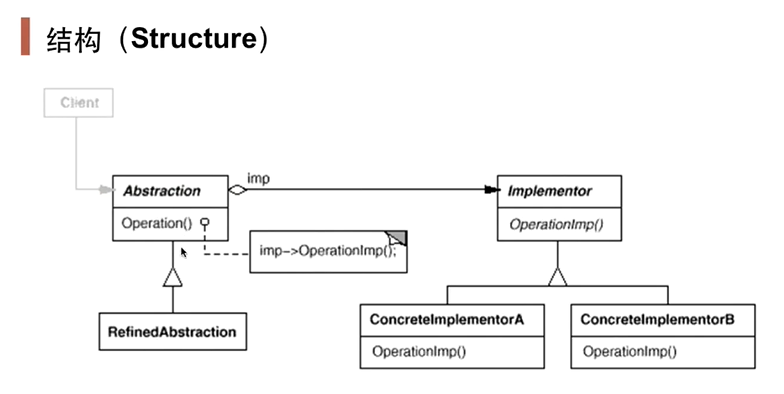

# 桥接模式

构造型的设计模式之一。Bridge模式基于类的最小设计原则，通过使用封装，聚合以及继承等行为来让不同的类承担不同的责任。它的主要特点是把抽象（abstraction）与行为实现（implementation）分离开来，从而可以保持各部分的独立性以及应对它们的功能扩展。

抽象功能和实现解耦，二者能够**独立扩展**！

1. 桥接模式适用在跨平台库的开发上，
2. 使用桥接会增加复杂度！