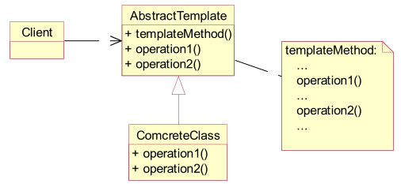

# 模板方法

定义一个算法步骤，并且允许子类为一个或多个步骤提供实现（延迟），在不改变算法结构的情况下，重新定义算法中的某个步骤！

Template Method模式一般应用在具有以下条件的应用中：

- 具有统一的操作步骤或操作过程
- 具有不同的操作细节
- 存在多个具有同样操作步骤的应用场景，但某些具体的操作细节却各不相同

总结：在抽象类中统一操作步骤，并规定好接口；让子类实现接口。这样可以把各个具体的子类和操作步骤接耦合。