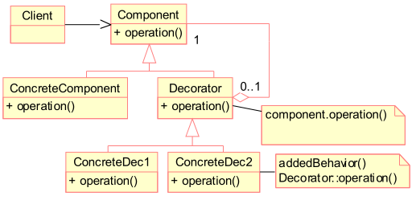
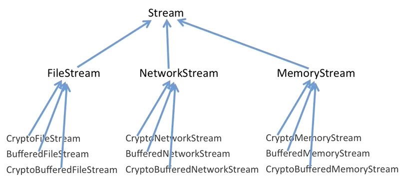
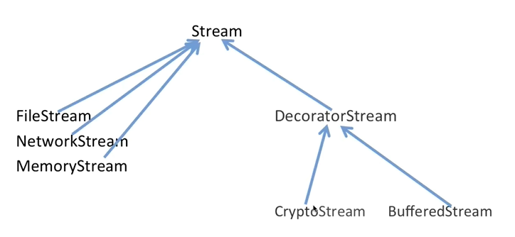
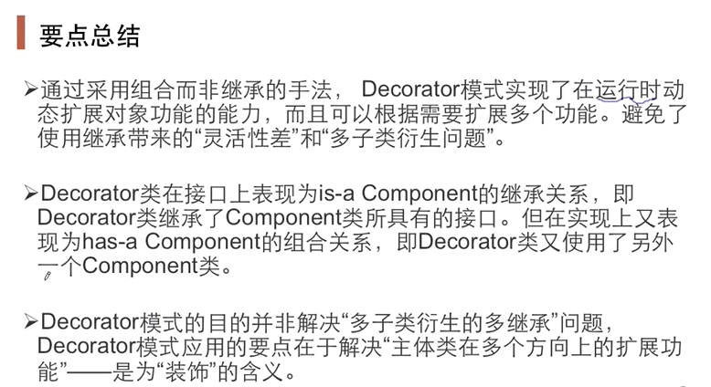

# 装饰器模式

又名包装模式，这种模式通过组合来扩展对象的功能，解决继承的子类膨胀问题！

装饰模式就是把要添加的附加功能分别放在单独的类中，并让这个类包含它要装饰的对象，当需要执行时，客户端就可以有选择地、按顺序地使用装饰功能包装对象。

如果使用继承来解决问题，那么扩展的功能会成为一个新的子类，这样的类数目将会以阶乘的形式增加。这种功能性继承并不灵活！

装饰器中的一个非常显著的特点就是**继承了公共父类又有一个父类指针！**，这个模式很好的体现了单一职责原则。扩展的功能放在职责类里，这个类可以包装其他类来提供该功能。

