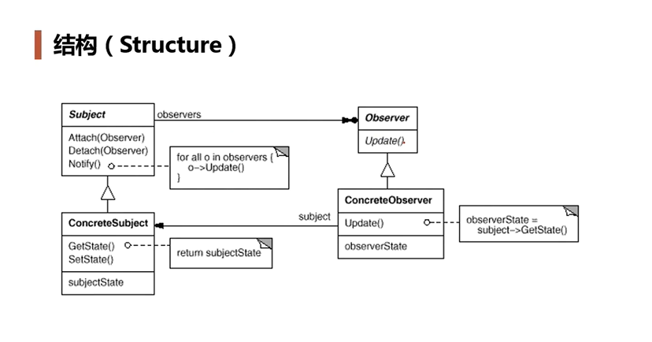
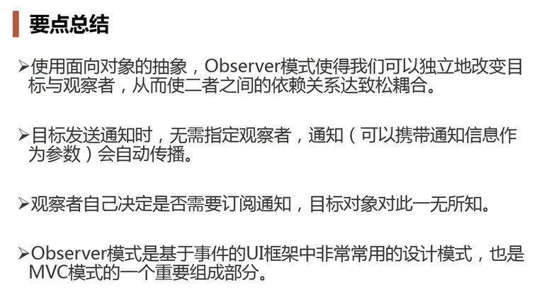

# 观察者模式

应用场景，如果一个UI程序中需要一个下载进度条，典型的做法是在下载模块（Subject）中添加这个下载组件的更新api。进度条的定义肯定是在高层UI中，这时候需要传递一个指针给下载模块，这代表着高层低层模块用到了高层模块的特定变量，违反了依赖倒置原则。当需求更改时，比如添加label来展示进度值，那么有需要在下载模块中增加一个label指针。显然不符合开闭原则。

观察者模式就是将高层和低层解耦。它的作用是当一个对象的状态发生变化时，能够自动通知其他关联对象，自动刷新对象状态。

在Subject中维护一个Observer队列

典型应用：

- 侦听事件驱动程序设计中的**外部事件**
- 侦听/监视某个对象的**状态变化**
- 发布者/订阅者(publisher/subscriber)模型中，当一个外部事件（新的产品，消息的出现等等）被触发时，通知邮件列表中的订阅者

适用于：定义对象间一种一对多的依赖关系，使得每一个对象改变状态，则所有依赖于他们的对象都会得到通知。

