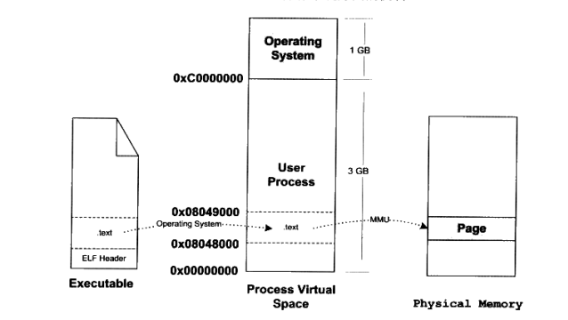

# 加载

当程序链接完成后已经是可执行的文件，二进制文件如何加载，毕竟只有在内存中文件才能被CPU执行。每个程序运行后会拥有自己独立的地址空间，虚拟地址空间（VAS），这个空间的大小是由CPU的寻址能力决定的，比如32位就只有4GB的寻址空间，而64位的处理器有 $2^{64}$ 的寻址能力。C的指针大小就代表了虚拟空间的位数。显然64位虚拟空间的大小超过了目前实际内存的大小，物理内存空间并没有这么大的空间，虚拟和物理的映射是一种解决方案 （MMU）

**虚拟空间的分配是由操作系统控制**

```dump
# Linux 4GB 地址空间 分配策略

+----------+  0xffffffff
|          |      OS       1GB
+----------+  0xc0000000
|          |
|          |  User Space   3GB
|          |
+----------+  0x00000000

# 0x0 ~ 0xbfffffff 是可使用的虚拟空间
```

硬盘数据如何载入内存？

1. 一次性全部载入 【太浪费】
2. 只放当前需要的和常用的部分，运行时缺哪些再载入 【局部性原理】

> 旧时代的节约内存的方法 OverLay 机制 
>
> 无依赖模块的相互覆盖 ->  跨模块调用 x
>
> 

## 页映射机制

与物理内存的分页机制相结合


物理内存必然受到限制，如果接下来要载入F4，但是没有空间可换则必然要选择一个页面进行替换 【页面替换算法】，操作系统中必然有个程序要进行内存页的替换管理！-> 存储管理器。

## 进程建立过程

1. 虚拟空间的建立 【并不是空间分配】
2. 建立虚拟空间和可执行文件的映射关系
3. 设置CPU IP 到ENTRY

虚拟空间的创建过程实际是分配一个数据结构用来记录该数据空间，读取文件头后建立虚拟内存空间与可执行文件的映射关系。

### 虚拟内存区域 （VMA）

记录结构中会保存 磁盘上 某个 段 的偏移 和虚拟页地址的关系

当程序开始启动时，设置了程序的入口地址，当CPU执行时，却发现这个页面是空页面 -> 缺页中断 于是根据映射关系将可执行文件中偏移量为n的数据载入分配的物理内存中，物理内存页和虚拟内存页面再进行关联。



## 映射关系