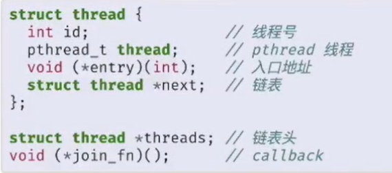
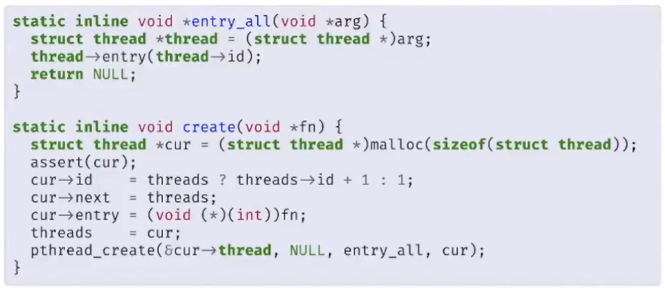
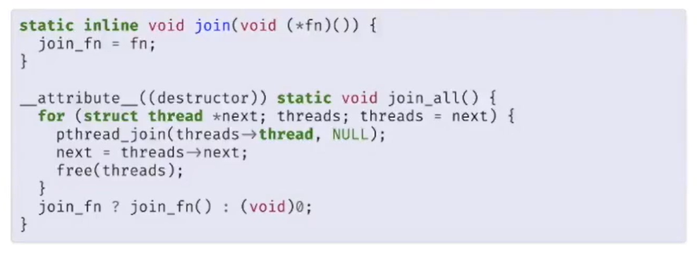

最早的并行程序--操作系统

多个程序加载 -> 如果一个程序崩溃 ？其他程序应该怎么处理

- 进程的地址空间应该独立，互相不会干扰
- 多任务 ？ 时间片切换 每个程序运行Xms切换
- 系统API的共享与使用 -> 体现并发

对于并发程序而言，时间片的切换可以达到并发，多个执行流并不按照特定顺序执行，而并行程序必须是在同时运行（多个处理器才能满足条件）

线程共享内存->多个执行流共享全局变量和代码（数据区域，堆）-> 指令执行的顺序不定（non-deterministic）

线程共享代码区，全局变量，而寄存器和局部变量（栈）独享

posix标准 thread wrap



create



destroy



线程地址空间

```
00007fe8f4021000  65404K -----   [ anon ]
00007fe8fb672000      4K -----   [ anon ]
00007fe8fb673000   8192K rw---   [ anon ]
00007fe8fbe73000      4K -----   [ anon ]
00007fe8fbe74000   8192K rw---   [ anon ]
00007fe8fc674000      4K -----   [ anon ]
00007fe8fc675000   8192K rw---   [ anon ]
00007fe8fce75000      4K -----   [ anon ]
00007fe8fce76000   8192K rw---   [ anon ]
00007fe8fd676000      4K -----   [ anon ]
00007fe8fd677000   8192K rw---   [ anon ]
00007fe8fde77000      4K -----   [ anon ]
00007fe8fde78000   8192K rw---   [ anon ]
00007fe8fe678000      4K -----   [ anon ]
00007fe8fe679000   8192K rw---   [ anon ]
00007fe8fee79000      4K -----   [ anon ]

# using pmap 
```

每一个线程处在一个 8M 的地址空间中，上下存在4k的不可读写的内存页

多线程的难点

1. 原子性 atomicity --> 一段代码不允许和其他代码并发 [dekker]
2. 执行顺序  编译器优化  内存序
3. 不可见 乱序执行 （假设 cache miss 可能会先执行后一条指令）

> 通过 volatile 修饰 避免优化
>
> 使用 barrier 阻隔 序列
>
> 使用 互斥 保证原子性

并发程序的理解

Peterson算法正确性证明

通过状态机模型判断！转换成图，不会有闭环，不会到达同时进入临界区的状态