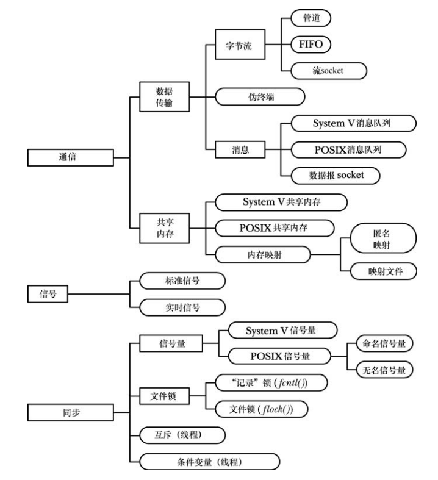
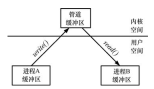
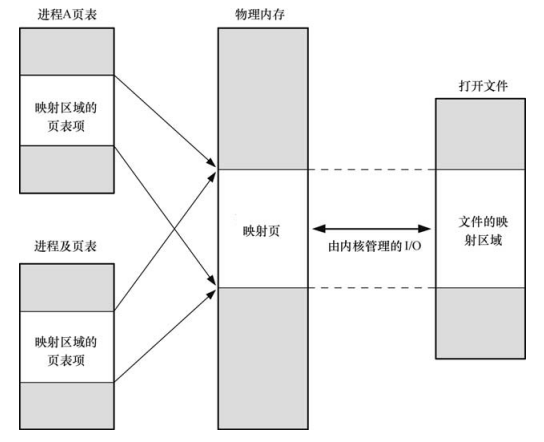

# 进程间通信

## IPC发展

```
UNIX IPC ---> SystemV IPC
				---> Posix IPC   ---> Linux IPC
		---> Socket IPC   
```

### Unix IPC



### IPC 三大类型

- 通信：这些工具关注**进程之间的数据交换** （管道 消息队列 套接字 共享内存）。
- 同步：这些进程关注进程和线程操作之间的**同步** （信号量，锁）。
- 信号：尽管信号的主要作用并不在此，但在特定场景下仍然可以将它作为一种同步技术。  

### 数据类型

1. 字节流 顺序
2. 消息数据 可分割 优先级
3. 二进制数据结构

### 通信工具

#### 借助传输工具（缓冲区）的通信

上图中数据传输的一部分，比如使用管道，消息队列，socket，这些传输方式借助了**内核缓冲区**（不管是以字节流还是消息格式），那就代表着从用户态到内核态的数据传输需要进行拷贝等操作，在写入和读取时，就会产生两次拷贝。



#### 共享内存

Linux下的内存映射机制是，虚拟内存到物理内存的映射，那么如果多个进程将虚拟内存映射到同一块物理地址空间中（每个进程中的**页表条目**指向同一个 **RAM 分页**  ），那么就可以在这块地址空间中进行通信。那么数据就可以直接在这块地址中读写，并且不需要使用系统调用传输内核数据。当然数据的访问必须得加锁来进行同步。共享内存的地址空间和共享库的地址空间等都位于地址空间的中间部分。

共享内存的通信速度相对更快，但速度上的优势是用来弥补需要对在共享内存上发生的操作进行同步的不足的。如当一个进程正在更新共享内存中的一个数据结构时，另一个进程就不应该试图读取这个数据结构。在共享内存中，信号量通常用来作为同步方法。  

共享文件也是一种共享内存的方式，但是由于存在了文件，这必然需要进行系统IO，会降低通信速度，但是文件的好处是能够将数据持久化存储。



### 同步工具

信号量机制，锁机制，这些能够在进程中进行*通信*，但是这种通信是为了使进程间达到某种同步的效果，或者互斥的操作。

### 特性

使用哪些工具来进行进程间通信？需要从哪些方面考虑？

1. 是否是本机通信？如果是跨主机通信，那么只能通过socket
2. 移植性问题 Posix 还是 SystemV
3. 可访问性，需要匿名？还是通过标识机制公开访问。
4. 持久性存储
5. 性能要求

## 常见的IPC

>1. 管道
>2. 信号
>3. 信号量
>4. 消息队列
>5. 共享内存
>6. 套接字

### 管道技术

管道技术是从UNIX上继承发展的，其特点是半双工（单向流动）【但有全双工的实现】，具有固定的读写端（两个 `fd` ）。在Linux系统中一切皆文件，管道可以看作是一种特殊的文件，可以通过 `read / write` 系统调用进行读写，但是文件并不存在于文件系统中，只在内存中，类似（`/proc`）。

管道分为两种类型，具名管道（`fifo`）和匿名管道（`pipe`），两种管道的操作与实现基本一致，都是通过**内核缓冲区**（这意味着数据存在用户态和内核态的拷贝）进行数据传输，但是建立等操作并不相同。

#### PIPE

`pipe` 的使用必须是存在亲缘关系的进程中，比如父子，兄弟进程即存在公共祖先的进程。通过`pipe(int fd[2])`系统调用创建并打开，`fd[0]`为读端，`fd[1]`为写端。

管道的读写是阻塞的，当`read`的写端为关闭状态时，所有数据都读完则返回0。当`write`的读端关闭时则产生`SIGPIPE`信号。

```bash
$ echo 'pipe' | more   # | 代表的是一个匿名管道，二者能够通信是因为都是shell创建的子进程
```

```c
#include <unistd.h>

int main(int argc, char const *argv[])
{
  int fd[2];
  pid_t pid;
  char line[1024];

  pipe(fd);
  pid = fork();

  if (pid > 0) { // parent
    write(fd[1], "this is parent pipe write port\n", 32);
    close(fd[0]);
  } else { // child
    int n = read(fd[0], line, 1024);
    write(STDOUT_FILENO, line, n);
    close(fd[1]);
  }

  return 0;
}
```

##### pipe的相关操作函数

- `popen`
- `pclose`

#### FIFO

`fifo`和`pipe`的主要区别在于，具名管道的名字对应于一个磁盘索引节点，通过这个文件名，**任何具备权限的进程**都可以对它进行访问。

`fifo`的主要用途有两个：

- 通过`shell`命令数据从一条管道传输到另一条时，不需要临时中间文件，和`pipe`的区别在于，可以线性连接多个进程。
- 在类C/S模型下，`fifo`作为汇聚点，在客户端和服务器进程间传递数据。

```bash
$ mkfifo fifo1  # 文件类型是 p (pipe)
$ echo 'test' > fifo1  # 数据传输到fifo，并且默认阻塞
$ less < fifo1  # 从fifo中读取数据后，上一个进程会才结束阻塞

# 输入过滤 线性串联
$ prog1 < fifo1
$ filter < process_file | tee fifo1 | prog2 # tee和fifo 将一个流转发到两个不同的进程，可以通过多个tee和fifo来串接。
```

##### fifo的相关操作函数

- `mkfifo`
- `mkfifoat`

#### 管道总结

管道的实质是一个内核缓冲区，进程以先进先出的方式从缓冲区读写数据，等价于一个环形对列，默认情况下，当数据写进管道没有读取时会被阻塞，同理读未关闭的空管道也会阻塞，一旦有数据出现就会解除阻塞。可以设置`O_NONBLCOK`成为非阻塞管道。

### System V 与 Posix

IPC中的两套不同的实现机制，消息队列，共享内存，信号量。

### 消息队列

消息队列是消息的链表，存储在**内核**中。用户进程可以向消息队列添加消息，也可以向消息队列读取消息。消息队列与管道通信相比，消息队列是全双工的，对每个消息指定特定的消息类型，接收的时候不需要按照队列次序，而是可以根据**自定义条件（优先级）**接收特定类型的消息。

可以把消息看做一个记录，具有特定的格式以及特定的优先级。对消息队列有写权限的进程可以向消息队列中按照一定的规则添加新消息，对消息队列有读权限的进程可以从消息队列中读取消息，但只有超级管理员权限的进程才能够修改消息大小的值。

#### System V 消息队列


## 参考

https://blog.csdn.net/zhaohong_bo/article/details/89552188