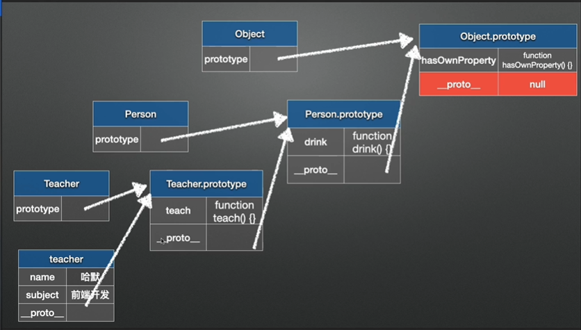

JS中的继承

JS中的继承基于原型链

> JavaScript 只有一种结构：对象。每个实例对象（ object ）都有一个私有属性（称之为 __proto__  **隐式原型**）指向它的构造函数的原型对象（**prototype**  **显式原型**）。该原型对象是对象，所以也有一个自己的隐式原型对象( __proto__ ) ，层层向上直到一个对象的原型对象为 `null`。根据定义，`null` 没有原型，并作为这个**原型链**中的最后一个环节。

原型链



属性的查找会从当前对象开始，如果没有找到就从原型中查找。

> 由于原型链等特性的存在，在不同对象之间功能的共享通常被叫做 **委托** - 特殊的对象将功能委托给通用的对象类型完成。这也许比将其称之为继承更为贴切，因为“被继承”了的功能**并没有被拷贝**到正在“进行继承”的对象中，相反它仍存在于通用的对象中。

JS对象的关键点是函数是一等公民，一切都是函数对象。

```javascript
function Person(name) {
  this.name = name;
}

let p1 = new Person("hyc");

Person.prototype.getName = function() {
  return this.name;
}

Person.prototype.copy = function() {
  return new this.constructor(this.name)
}

function Student(name, score) {
  Person.call(this, name);
  this.score = score;
}

// 通过create继承prototype
Student.prototype = Object.create(Person.prototype);
// 如果不设置constructor那么指向的方法将是父类构造函数
Student.prototype.constructor = Student
Student.prototype.getScore = function() {
  return this.score;
}

let s1 = new Student('hyc', 100);

// es6 语法糖
class Human {
  constructor(name) {
    this.name = name;
  }

  drink() {
    console.log(`${this.name} drink water`);
  }
}

// extends 可以使用class 或者 function对象
class Male extends Human {
  constructor(name, age) {
    super(name)
    this.age = age;
  }

  Play() {
    console.log('play game');
  }
}

let m = new Male('hyc', 22);
```

### 参考

[MDN Class](https://developer.mozilla.org/zh-CN/docs/Web/JavaScript/Reference/Classes)

[MDN Inheritence](https://developer.mozilla.org/zh-CN/docs/Learn/JavaScript/Objects/Inheritance)

[MDN prototype chain](https://developer.mozilla.org/zh-CN/docs/Web/JavaScript/Inheritance_and_the_prototype_chain)