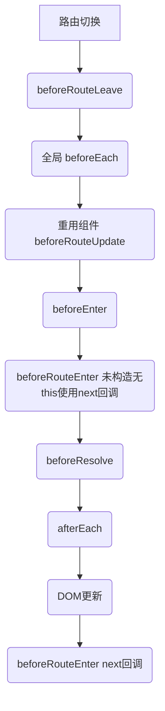

# 踩坑记录


#### 模块名称问题

```js
components: {
    default: UserProfile,  // router-view 如果没有name属性 则是default
    helper: UserProfilePreview
}

components: {
    User,  // 如果不加名称直接写对象，那么等价于 User: User, name是User
    helper: UserProfilePreview
}
```

####  Router mode

```js
{
    mode: 'hash', // 默认类型通过 锚点
    mode: 'history', // 使用history.pushState进行页面跳转 url无# 但是会直接访问这个连接
}

// mode
'/index.html#/setting/profile'
// history
'/setting/profile'  // 这种连接后台正常解析 不会得到 index.html 所以需要特殊处理
// nginx 配置
location / {
  try_files $uri $uri/ /index.html;
}
```

#### 守卫指向流程

```
导航被触发。
在失活的组件里调用 beforeRouteLeave 守卫。
调用全局的 beforeEach 守卫。
在重用的组件里调用 beforeRouteUpdate 守卫 (2.2+)。
在路由配置里调用 beforeEnter。
解析异步路由组件。
在被激活的组件里调用 beforeRouteEnter。
调用全局的 beforeResolve 守卫 (2.5+)。
导航被确认。
调用全局的 afterEach 钩子。
触发 DOM 更新。
调用 beforeRouteEnter 守卫中传给 next 的回调函数，创建好的组件实例会作为回调函数的参数传入。
```




